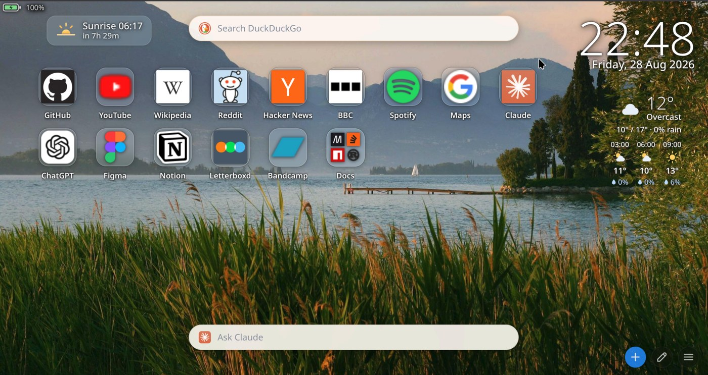
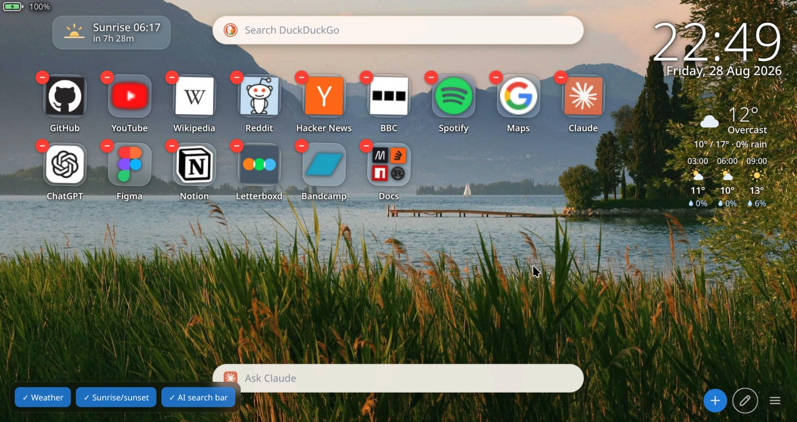
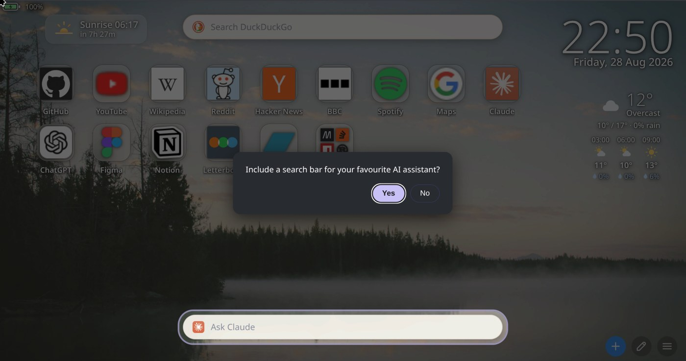

# Home Screen

[](LICENSE)

**A browser new tab page laid out like a phone home screen — an app grid you arrange yourself, with real site icons, weather, a sunrise countdown, and a bar that sends a question straight to an AI assistant.** No build step, no dependencies: three files and a folder of wallpapers.

<p align="center">
  
</p>

## Why

The default new tab page shows whatever you happened to visit most last week. It reorders itself without being asked, and there is no way to say *these nine things, in this order, permanently*. A phone home screen works the other way round: you place things, and they stay placed.

## The grid

Tiles are added by hand. Nothing is ranked by visit count and nothing moves on its own. Drag one tile onto another to make a folder.

Icons come from a chain, tried in order:

1. A custom icon, if you uploaded one
2. The site's own `/apple-touch-icon.png`
3. DuckDuckGo's icon service
4. The browser's own favicon cache
5. The first letter of the name

Whatever it finds is cached as a data URL, so a site is looked up once. Uploaded icons are trimmed automatically: transparent margins are scanned away with a noise floor, then the artwork is scaled into a square. The noise floor is there because several downloaded logos carry faint opaque speckles across the whole canvas, which defeats an ordinary trim.

<p align="center">
  
</p>

## Weather, sun and battery

A weather block, a countdown to the next sunrise or sunset, and a battery readout sit around the grid. Each is optional: a setup wizard asks which you want on first run, and edit mode toggles them later. Turning one off stops the work as well as the display — with both weather and the countdown off, no forecast is fetched.

Weather comes from [Open-Meteo](https://open-meteo.com): no key, no signup, cached for thirty minutes. The location is chosen by name from a search box rather than by asking the browser where you are, which behind a VPN answers wrongly.

## The assistant bar

The bar along the bottom takes a question and opens it in Claude, ChatGPT, Google AI Mode, Grok or Perplexity — or anything else you give a URL for.

Your question is placed in the assistant's composer, and you press enter once more to send it. That second keystroke is not an oversight: sites show a warning when a prompt arrives from outside the chat box, and require the confirmation, because a link can otherwise submit text you never read.

<p align="center">
  
</p>

The setup wizard dims the page and cuts a hole over whatever each question is about.

## Install

Not on any store — load it unpacked.

1. Clone this repository.
2. Open `chrome://extensions`, or `brave://extensions` in Brave.
3. Turn on **Developer mode**.
4. Click **Load unpacked** and select the repository folder.
5. Open a new tab.

Works on Chromium browsers on Linux, macOS and Windows — Brave, Chrome, Edge, Vivaldi. Firefox and Safari are not supported; it uses `chrome_url_overrides` and Chromium extension APIs.

> Loading the extension from a different folder changes its ID and clears its storage. Export your profile before moving it.

To see it populated straight away, import [`demo.json`](demo.json) from **Select profile → Browse**.

## Controls

- **+** adds a shortcut. Leave the address blank to create a folder instead.
- **Pencil** toggles edit mode: minus badges delete, clicking a tile opens rename, URL and icon options, and a panel bottom-left switches each widget on or off.
- **Hamburger** holds profiles and settings.
- Either bar's icon changes the search engine or the assistant. Both accept a custom URL with the query at the end.

## Profiles

A profile is the whole configuration — tiles, icons, search engine, assistant, widget choices and weather location — saved under a name and switched from the menu. Profiles live in the browser, so there is no folder to choose and nothing to set up before the first save. **Settings → Profiles → Export** writes one out as JSON, for a backup or another machine.

## Privacy

No account, no telemetry, no server. Everything is stored locally. Three parties are contacted, all directly by your browser and only when there is something to fetch:

| Who | When | What they receive |
|---|---|---|
| The site itself | A tile has no icon cached | A request for its `apple-touch-icon.png` |
| `icons.duckduckgo.com` | That request failed | The hostname of that site |
| `open-meteo.com` | Weather is switched on | The coordinates you chose |

Because both are cached, neither lookup repeats. Clear the icon cache under **Settings → General**. DuckDuckGo is used rather than Google's equivalent service on privacy grounds, at the cost of lower-resolution icons.

### Permissions

| Permission | Why |
|---|---|
| `favicon` | Read the browser's own favicon cache — the last resort for a tile icon |
| `downloads` | Write an exported profile without prompting for a folder |
| `https://*/*`, `http://*/*` | Fetch icons from any site you add, including LAN services on plain HTTP |

The host permissions are broad because a tile can point anywhere. They are used only to fetch icons.

## Wallpapers

`bg/` ships with 63 photographs from [Lorem Picsum](https://picsum.photos), served under the [Unsplash License](https://unsplash.com/license) and credited to their photographers in [CREDITS.md](CREDITS.md).

To use your own, replace the contents of `bg/` — one image is chosen at random per tab — and regenerate the list of filenames:

```sh
ls bg | sed 's/.*/"&"/' | paste -sd, - | sed 's/^/const BG=[/; s/$/];/' > bglist.js
```

A stale or empty `bglist.js` renders a black page.

## Development

```
manifest.json    MV3 manifest
newtab.html      markup and all the CSS
newtab.js        all the logic
bglist.js        generated list of wallpaper filenames
bg/              wallpapers
```

Change a file, hit reload on `chrome://extensions`, open a new tab. Only `manifest.json` changes need that reload — HTML, CSS and JS are picked up by opening a tab. Errors appear in DevTools on the new tab page. There is no test suite.

[`DECISIONS.md`](DECISIONS.md) records why things are the way they are — why inline `<script>` is impossible here, why `img.crossOrigin` must never be set, why layout derives from the search bar's geometry rather than fixed pixels. Worth reading before changing any of them.

## Contributing

Issues and pull requests are welcome — this started as a personal tool and is shared in case it is useful to someone else.

## License

MIT, covering the code. See [`LICENSE`](LICENSE). The wallpapers are Unsplash-licensed, as above. Product names and logos belong to their owners; none is bundled — they are fetched from the sites themselves at runtime.
